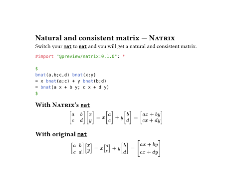

# [Natrix](https://github.com/Enter-tainer/Natrix)

`natrix.nat` is a drop-in replacement for `mat` with some additional features. `nat` ensures that each row in your matrix should have the similar height, unless one of them becomes too tall.

## Documentation

### `nat`

Every thing is the same as `mat` in typst.

This package also provides `bnat`, `Bnat`, `vnat`, `Vnat`,
